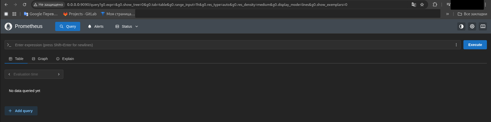

# Лабораторная работа №8  

## Выполнена в рамках прохождения обучения по курсу DevOps СИТУ  

Результат запуска приложения в браузере  

Запущенный prometheus в браузере  

Приложение отдаёт метрики  

Запущенный blackbox 

Графики grafana по доступности сайтов  

Графики grafana по количеству посещений страницы приложения  
